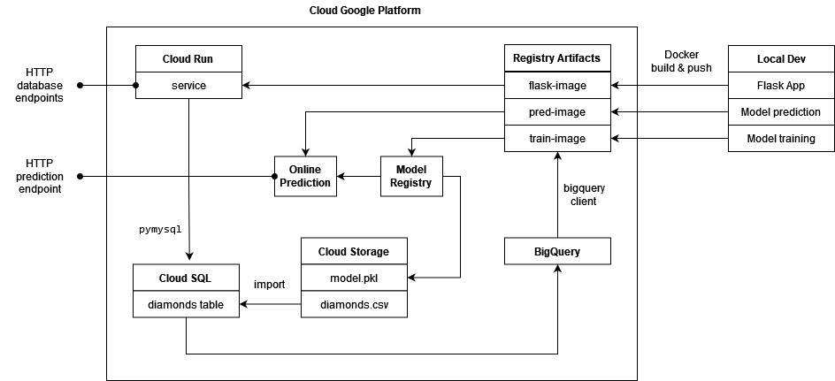

# xtream AI Challenge

## Ready Player 1? 🚀

Hey there! If you're reading this, you've already aced our first screening. Awesome job! 👏👏👏

Welcome to the next level of your journey towards the [xtream](https://xtreamers.io) AI squad. Here's your cool new assignment.

Take your time – you've got **10 days** to show us your magic, starting from when you get this. No rush, work at your pace. If you need more time, just let us know. We're here to help you succeed. 🤝

### What You Need to Do

Think of this as a real-world project. Fork this repo and treat it as if you're working on something big! When the deadline hits, we'll be excited to check out your work. No need to tell us you're done – we'll know. 😎

🚨 **Heads Up**: You might think the tasks are a bit open-ended or the instructions aren't super detailed. That’s intentional! We want to see how you creatively make the most out of the data and craft your own effective solutions.

🚨 **Remember**: At the end of this doc, there's a "How to run" section left blank just for you. Please fill it in with instructions on how to run your code.

### How We'll Evaluate Your Work

We'll be looking at a bunch of things to see how awesome your work is, like:

* Your approach and method
* Your understanding of the data
* The clarity and completeness of your findings
* How you use your tools (like git and Python packages)
* The neatness of your code
* The readability and maintainability of your code
* The clarity of your documentation

🚨 **Keep This in Mind**: This isn't about building the fanciest model: we're more interested in your process and thinking.

---

### Diamonds

**Problem type**: Regression

**Dataset description**: [Diamonds Readme](./datasets/diamonds/README.md)

Meet Don Francesco, the mystery-shrouded, fabulously wealthy owner of a jewelry empire. 

He's got an impressive collection of 5000 diamonds and a temperament to match - so let's keep him smiling, shall we? 
In our dataset, you'll find all the glittery details of these gems, from size to sparkle, along with their values 
appraised by an expert. You can assume that the expert's valuations are in line with the real market value of the stones.

#### Challenge 1

Plot twist! The expert who priced these gems has now vanished. 
Francesco needs you to be the new diamond evaluator. 
He's looking for a **model that predicts a gem's worth based on its characteristics**. 
And, because Francesco's clientele is as demanding as he is, he wants the why behind every price tag. 

Create a Jupyter notebook where you develop and evaluate your model.

#### Challenge 2

Good news! Francesco is impressed with the performance of your model. 
Now, he's ready to hire a new expert and expand his diamond database. 

**Develop an automated pipeline** that trains your model with fresh data, 
keeping it as sharp as the diamonds it assesses.

#### Challenge 3

Finally, Francesco wants to bring your brilliance to his business's fingertips. 

**Build a REST API** to integrate your model into a web app, 
making it a cinch for his team to use. 
Keep it developer-friendly – after all, not everyone speaks 'data scientist'!

#### Challenge 4

Your model is doing great, and Francesco wants to make even more money.

The next step is exposing the model to other businesses, but this calls for an upgrade in the training and serving infrastructure.
Using your favorite cloud provider, either AWS, GCP, or Azure, design cloud-based training and serving pipelines.
You should not implement the solution, but you should provide a **detailed explanation** of the architecture and the services you would use, motivating your choices.

So, ready to add some sparkle to this challenge? Let's make these diamonds shine! 🌟💎✨

---

## How to run

I've developed a package with a folder for each challenge. 

### Installing

First, clone the repo
```shell
git clone https://github.com/sfcaracciolo/xtream-ai-assignment-engineer.git
```
Then, create a venv in the cloned folder `xtream-ai-assignment-engineer`
```shell
python -m venv . 
```
activate it, *On windows*
```shell
Scripts\activate
```
*On linux*
```shell
source ./bin/activate
```
Finally, install the package and deps,
```shell
pip install . 
```
### Setting

Please, edit the 4 **absolute** paths defined on the `.env` file. It's important for testing and dev.

### Testing
Run tests for challenge 3
```shell
pytest tests -s -v
```
It will create a `tests_temp` folder to build database and models in testing enviroment.

### Challenge 1

Just open the jupyter notebook (default port 8888)
```shell
jupyter notebook src\challenge1\main.ipynb
```

### Challenge 2

I've developed a class called `Model` which enherits `LinearRegression`. I've added some static methods to re use it in the jupyter notebook, such as:

* curation_inplace()
* featuring_inplace()
* encoding_inplace()
* extract_features()
* extract_target()

I've reimplemented `.fit()` and `.predict()` to encapsulate featuring, encoding and transforms. In this way, data incomes to the model like Francesco handle it. 

In order to build the model, a `.build()` classmethod was developed which curation is performed before training to avoid wrong labels in cut/color/clarity features, duplicated diamonds, missing values and out-of-range values.

To use the automated pipeline a cli was developed. Just run,
```shell
python src\challenge2\builder.py -s [SRC_FILE] -d [DST_FILE]
```
where the source is a csv file with the diamonds dataset and destination is a pickle file with the trained model instance. Type `-h` for help. Example:
```shell
python src\challenge2\builder.py -s "datasets\diamonds\diamonds.csv" -d "datasets\diamonds\model.pickle"
```
### Challenge 3

An API was developed with flask and sqlite in `src\challenge3\__init__.py`. All endpoints are `json/application` with raw json data as input/output builded as a combination of 3 dicts:
```python
ID = { 'id': int }
PRICE = { 'price': float }
FEATURES = {
    'carat' : float,
    'cut' : str,
    'color' : str,
    'clarity' : str,
    'depth' : float,
    'table' : float,
    'x' : float,
    'y' : float,
    'z' : float,
}
```
The endpoints:
* **POST**: `diamond/create` inserts diamond to database.
  * Input: PRICE | FEATURES
  * Output: ID | PRICE | FEATURES
* **GET**: `diamond/read` read diamond from database.
  * Input: ID
  * Output: ID | PRICE | FEATURES
* **PUT**: `diamond/update`
  * Input: ID | PRICE | FEATURES
  * Output: ID | PRICE | FEATURES
* **DELETE**: `diamond/delete`
  * Input: ID
  * Output: ID
* **GET**: `diamond/table` returns whole table.
  * Input: {} (void)
  * Output: [ID | PRICE | FEATURES] (list of dicts)
* **GET**: `model/predict` returns price prediction.
  * Input: FEATURES
  * Output: PRICE
* **PUT**: `model/update` backup of current model in BACKUP_MODELS_PATH, then rebuild model with current data and overwrite CURRENT_MODEL_PATH.
  in database.
  * Input: {} (void)
  * Output: {'msg': 'Model updated.'}

The decorator called `@validator` checks Content-Type (error 415), json keys and datatypes required (error 400). If id is not found in diamond read/update/delete a 404 is raised. If a method isn't defined in a endpoint, it'll raise 400.

Just run (default port 5000)
```shell
flask --app src\challenge3 run
```
In first time execution, a `database.sqlite` and `model.pickle` will be created according to DB_FILE and CURRENT_MODEL_PATH defined in `.env`  file.

### Challenge 4

I am going to use GCP with the following architecture:

.

We can create a docker image for the endpoints related to the database and expose it in Cloud Run. The database can be a MySQL server created in Cloud SQL. To initialise it we upload `diamonds.csv` to a Cloud Storage bucket and import the csv into a table previously initialised with SQL Studio. So far we have implemented Francesco's business data load.

For the ML model, we can use Vertex AI. We create two scripts: training and prediction. We create the docker images and upload them to Registry Artifacts. On the one hand, through Model Registry we link the image and a bucket where we save the trained model in pickle formatting. The data for training is acquired through a bigquery client linked to Cloud SQL. On the other hand, the training image is associated with the registered model and an endpoint is exposed to compute online predictions.

Some observations: 
  * All connections are through private IPs, except HTTP endpoints.
  * The initialisation of the table in Cloud SQL requires creating a user to use SQL Studio.
  * To perform the csv import to Cloud SQL it is necessary to give permissions to the service account of the SQL instance in the Cloud Storage Bucket.
  * Several of the above operations can be automated with `gcloud`.
  * To access Cloud SQL from the Cloud Run service, `mysql+pymysql://<db_user>:<db_pass>@<db_host>:<db_port>/<db_name>` must be used.
  * The Flask application must have `gunicorn` in production.